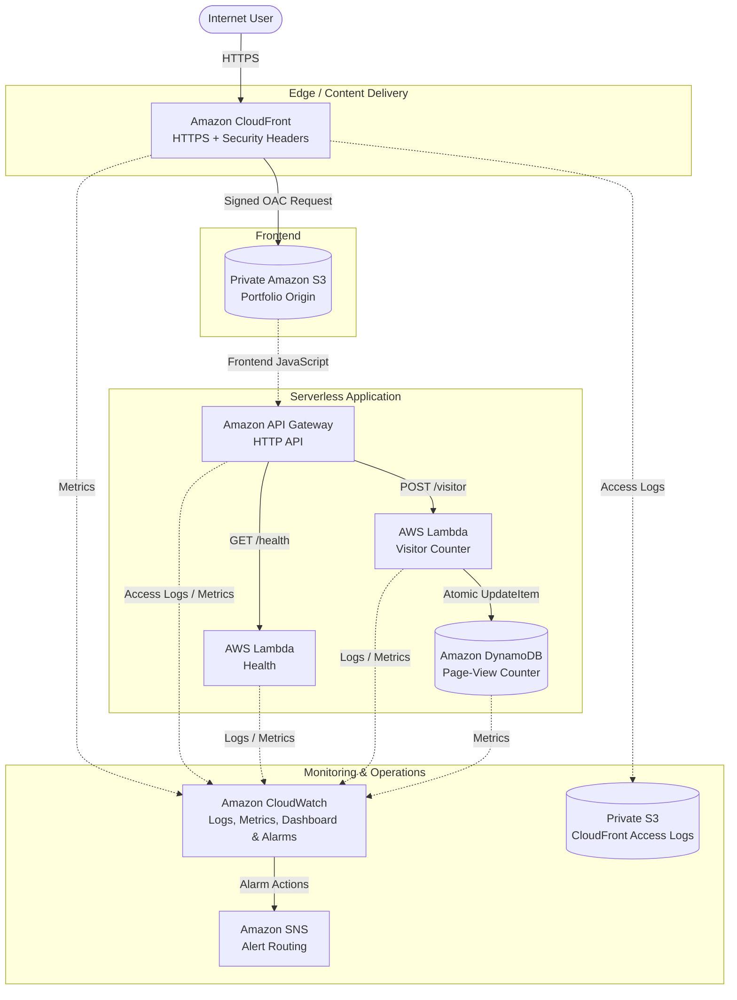

# Application Architecture

This diagram represents the currently deployed and validated development environment for the Secure AWS Cloud Portfolio Platform.



## Security Boundaries

The architecture applies several security boundaries:

- The portfolio S3 bucket is private.
- CloudFront accesses the origin through Origin Access Control (OAC).
- Direct public access to the portfolio S3 bucket is denied.
- Client traffic is redirected to HTTPS at CloudFront.
- API CORS is restricted to the portfolio origin.
- Lambda permissions are scoped to required application operations.
- DynamoDB encryption and point-in-time recovery are enabled.
- CloudFront access logs are stored in a dedicated private S3 logging bucket.
- CloudWatch provides centralized logs, metrics, alarms, and operational visibility.

## Request Paths

### Portfolio Delivery

```text
Internet
   ->
CloudFront
   ->
Signed OAC Request
   ->
Private S3
```

### Visitor Analytics

```text
Browser
   ->
POST /visitor
   ->
API Gateway
   ->
Visitor Lambda
   ->
DynamoDB
```

### Health Validation

```text
GET /health
   ->
API Gateway
   ->
Health Lambda
   ->
{"status":"healthy"}
```

The health route is intentionally separated from visitor analytics so operational and CI/CD validation does not modify the page-view counter.