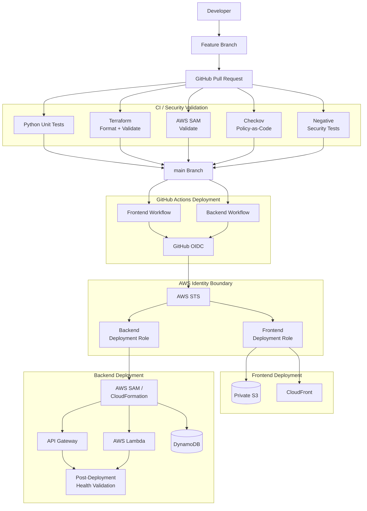

# DevSecOps and CI/CD Architecture

This diagram represents the validated delivery and security-control architecture for the Secure AWS Cloud Portfolio Platform.



## Security Model

The CI/CD architecture is designed around several principles:

### Short-Lived AWS Authentication

```text
GitHub Actions
      ->
GitHub OIDC Token
      ->
AWS STS
      ->
Temporary AWS Credentials
```

Long-lived AWS access keys are not required by the deployment workflows.

### Separate Deployment Roles

Frontend and backend deployments use separate IAM roles.

This reduces unnecessary permission sharing between delivery workflows.

### Preventive Pull-Request Controls

Before infrastructure or backend changes are merged, the Policy-as-Code workflow evaluates:

- Python unit tests
- Terraform formatting
- Terraform validation
- AWS SAM validation
- Curated Checkov controls
- Negative security tests

### Deployment Validation

The backend deployment does not stop after CloudFormation deployment.

The workflow discovers the deployed health endpoint and requires a successful application response.

```text
Deploy
   ->
Discover Endpoint
   ->
HTTP Request
   ->
HTTP 200 + healthy
   ->
Deployment Validation Success
```

### Fail-Safe Behavior

Task 09 demonstrated two controlled deployment failures:

1. An undeclared `boto3` dependency was rejected during CI testing before AWS deployment.
2. A missing AWS SAM transform permission was denied by the workload-scoped IAM deployment role.

Both failures were remediated through feature branches and pull requests before the final successful deployment.

This demonstrates that the delivery pipeline is capable of preventing or stopping changes when application or authorization requirements are not satisfied.